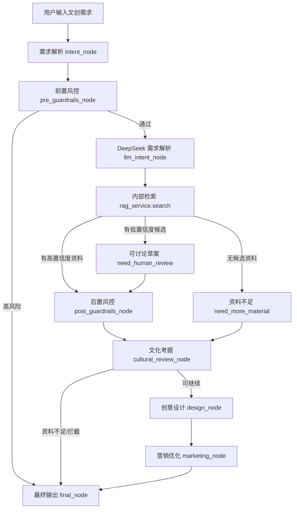

# 文创 Agent 流程

文创 Agent 是后端内部服务，代码位置：

```text
backend/app/services/agent.py
backend/app/api/v1/agent.py
```

它不再作为独立服务运行，也不再通过另一个端口做 HTTP 检索适配。检索统一走当前后端内部的 `rag_service.search()`，数据来自：

```text
backend/data/vector_store.sqlite3
backend/data/chroma/
```

## 主流程



## 状态

| 状态 | 含义 | 处理 |
|---|---|---|
| `ok` | 检索到足够史料且无重大风险 | 完整生成考据、设计、营销 |
| `need_more_material` | 无史料或置信度不足 | 不生成方案，提示补充素材 |
| `need_human_review` | 低置信度候选、版权不明、存在争议或疑似商用 IP | 可生成草案，但标注人工复核 |
| `blocked` | 命中文化安全高风险表达 | 直接停止 |

## 核心原则

- 有史料再生成。
- 低置信度可生成讨论草案，但必须标注人工核验。
- 争议史料和版权风险必须标注人工复核。
- 数据库逻辑留在 `vector_store` 和 `rag_service`，Agent 只消费 Evidence。
- Agent 编排使用 LangGraph，LLM 调用通过 OpenAI SDK 兼容 DeepSeek。
