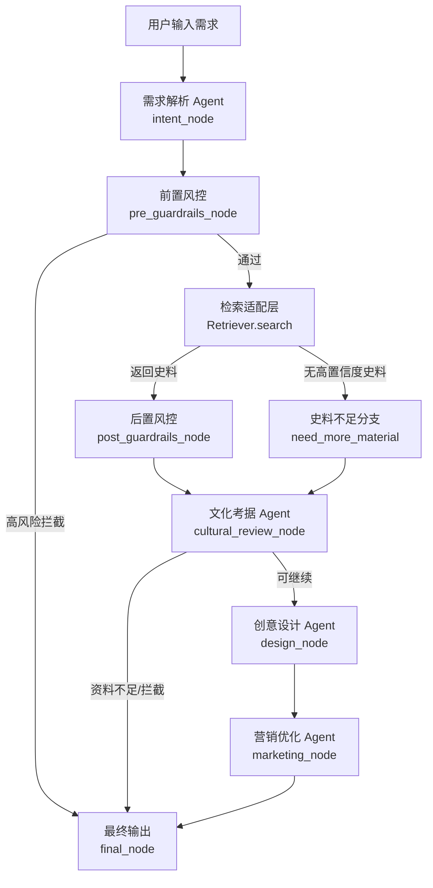

# 文创 Agent 流程设计

这份流程用于指导当前项目开发。数据库由同事单独维护，本项目当前只保留检索接口和 Mock 数据源，后续从 GitHub 拉取数据库项目后替换 `Retriever` 适配层即可。

## 1. 总体目标

文创 Agent 要完成一条稳定链路：

用户输入文创需求后，系统先识别任务类型，再检索文化史料，进行文化考据和风险校验，最后生成文创方案与营销文案。

核心原则：

- 有史料再生成。
- 低置信度不硬编。
- 争议内容标注人工核验。
- 商用 IP 和版权风险前置拦截。
- 数据库实现可替换，Agent 流程不依赖具体数据库。

## 2. 主流程图



## 3. 节点说明

| 节点 | 代码位置 | 输入 | 输出 | 作用 |
|---|---|---|---|---|
| 需求解析 | `wc_agent/agents.py::intent_node` | `user_query` | `intent`、`keywords`、`style` | 判断是 IP 设计、策展、文案还是问答 |
| 前置风控 | `wc_agent/guardrails.py::pre_guardrails_node` | `user_query` | `status`、`warnings` | 拦截篡改历史、恶搞文化、明显侵权等输入 |
| 检索层 | `wc_agent/graph.py::make_retrieve_node` | `keywords` | `evidence` | 当前使用 Mock JSONL，后续替换为同事数据库 |
| 后置风控 | `wc_agent/guardrails.py::post_guardrails_node` | `evidence` | `warnings`、`status` | 检查版权状态、风险等级，必要时标记人工复核 |
| 文化考据 | `wc_agent/agents.py::cultural_review_node` | `query`、`evidence` | `cultural_review` | 输出文化溯源、可用元素、慎用点、人工核验点 |
| 创意设计 | `wc_agent/agents.py::design_node` | `cultural_review`、`style` | `design_plan` | 生成产品定位、设计思路、款式、工艺建议 |
| 营销优化 | `wc_agent/agents.py::marketing_node` | `design_plan` | `marketing_copy` | 生成小红书、抖音、电商详情页表达 |
| 最终输出 | `wc_agent/graph.py::final_node` | 全部状态 | `final_answer` | 汇总任务识别、风险提示、证据、方案和文案 |

## 4. 状态流转

当前 Agent 使用 `WenchuangState` 作为全局状态。

关键字段：

| 字段 | 含义 |
|---|---|
| `user_query` | 用户原始需求 |
| `intent` | 任务类型：`ip_design`、`exhibition`、`copywriting`、`qa` |
| `keywords` | 检索关键词 |
| `style` | 风格变量：国潮厚重风、潮玩年轻化风、极简博物馆风 |
| `evidence` | 检索证据列表 |
| `cultural_review` | 文化考据结果 |
| `design_plan` | 文创方案 |
| `marketing_copy` | 营销文案 |
| `warnings` | 风险、版权、复核提示 |
| `status` | 当前状态 |
| `final_answer` | 最终整合输出 |

状态枚举：

| 状态 | 触发条件 | 处理方式 |
|---|---|---|
| `ok` | 检索到足够史料且无重大风险 | 完整生成考据、设计、营销 |
| `need_more_material` | 无史料或检索置信度不足 | 不生成方案，提示补充素材/等待数据库 |
| `need_human_review` | 版权不明、存在争议或疑似商用 IP | 可以生成草案，但必须标注人工复核 |
| `blocked` | 命中文化安全高风险表达 | 直接停止，不进入生成链路 |

## 5. 异常分支

### 5.1 无史料

触发：

- Mock 数据源未匹配到内容。
- 后续真实数据库返回空。
- 真实数据库返回结果均低于阈值。

处理：

- `status = need_more_material`
- 不进入设计和营销生成。
- 输出提示：等待数据库或补充素材。

### 5.2 版权风险

触发：

- 用户输入包含受保护 IP。
- 检索证据中 `copyright_status` 不是 `public_domain` 或 `authorized`。

处理：

- `status = need_human_review`
- 允许继续生成草案，但最终输出必须标注授权复核。

### 5.3 文化安全风险

触发：

- 输入包含篡改历史、恶搞烈士、低俗化、历史虚无主义等高风险表达。

处理：

- `status = blocked`
- 直接进入最终输出。
- 不检索、不设计、不营销。

### 5.4 争议史料

后续数据库接入后建议增加：

- evidence 增加 `is_controversial` 字段。
- 如果任一证据为争议史料，状态设为 `need_human_review`。
- 文化考据 Agent 必须输出多方观点和人工核验点。

## 6. 数据库接入边界

现在不要把数据库逻辑写死进 Agent。真实数据库只需要实现统一接口：

```python
class MyDatabaseRetriever:
    def search(self, query: str, n_results: int = 5) -> list[Evidence]:
        ...
```

返回的 `Evidence` 字段必须包含：

```python
Evidence(
    text="史料正文",
    source="来源",
    category="类别",
    culture_theme="文化主题",
    confidence=0.82,
    copyright_status="public_domain",
    risk_level="low",
)
```

接入方式：

```python
from wc_agent.graph import run_agent

result = await run_agent(
    "敦煌保温杯文创，偏国潮厚重风",
    retriever=MyDatabaseRetriever(),
)
```

## 7. 当前 MVP 演示流程

演示输入：

```text
敦煌保温杯文创，偏国潮厚重风，输出小红书文案
```

预期输出：

1. 识别为 `copywriting`。
2. 提取关键词：敦煌保温杯文创、国潮厚重风、小红书文案。
3. 从 Mock 知识库检索到敦煌藻井、敦煌壁画色彩、小红书文案、保温杯文创等证据。
4. 输出文化考据。
5. 输出文创产品方案。
6. 输出小红书、抖音、电商卖点。

运行：

```powershell
.\.venv\Scripts\python.exe wenchuang_agent.py "敦煌保温杯文创，偏国潮厚重风，输出小红书文案"
```

## 8. 下一步开发顺序

建议按这个顺序继续：

1. 把 FastAPI `/chat` 跑起来，让外部能调用 Agent。
2. 增加 10 条测试用例，覆盖无史料、版权风险、拦截、正常生成。
3. 等数据库同事代码拉下来后，实现真实 `Retriever`。
4. 增加流式输出。
5. 再接文生图、联网检索、文档导出等工具。

