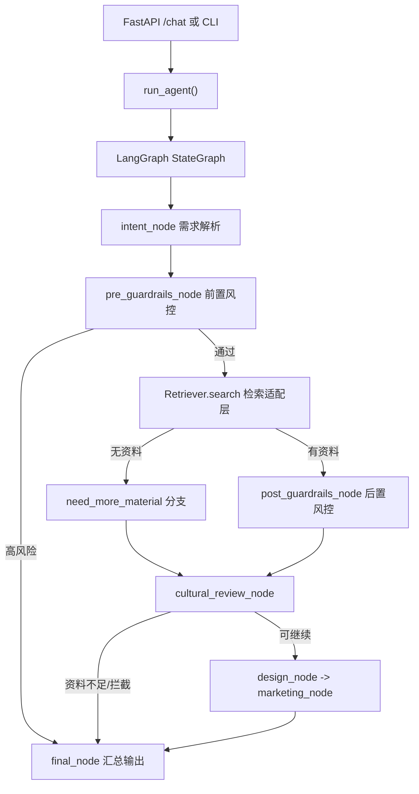

# 文创 Agent 项目架构说明

更新时间：2026-07-09

这份文档用于说明当前 `D:\User\work\shujuku\agent` 文创 Agent 子工程的代码分层、请求链路、数据结构和后续数据库接入方式。

## 1. 总体定位

当前项目是一个文创 Agent MVP，目标是先跑通：

```text
用户需求
-> 意图识别
-> 风控
-> 检索史料
-> 文化考据
-> 创意设计
-> 营销文案
-> 标准化输出
```

数据库由同一仓库下的 `backend/` 维护。Agent 不直接管理资料入库，只通过检索适配器读取资料并转成 `Evidence`。

## 2. 目录结构

```text
D:\User\work\shujuku\agent
├─ wenchuang_agent.py          # 命令行入口
├─ wc_agent/
│  ├─ api.py                   # FastAPI 对外接口
│  ├─ cli.py                   # 命令行运行逻辑
│  ├─ graph.py                 # LangGraph 主流程编排
│  ├─ agents.py                # 需求解析、文化考据、创意设计、营销 Agent 节点
│  ├─ guardrails.py            # 前置/后置风控节点
│  ├─ llm.py                   # DeepSeek/OpenAI-compatible 统一调用封装
│  ├─ retrievers.py            # Mock、Chroma、未来数据库检索适配器
│  ├─ settings.py              # .env 与运行配置
│  ├─ state.py                 # Pydantic 全局状态和 Evidence 结构
│  ├─ prompts.py               # Prompt 文件读取
│  ├─ data/
│  │  └─ sample_knowledge.jsonl # 本地 Mock 史料
│  └─ prompts/
│     ├─ cultural_review.md
│     ├─ design.md
│     └─ marketing.md
├─ tests/                      # 单元测试和 API 测试
├─ scripts/                    # 辅助脚本
└─ docs/                       # 架构、流程、模型和接入文档
```

## 3. 核心调用链路



## 4. 关键模块说明

| 模块 | 职责 |
|---|---|
| `wc_agent/api.py` | 对外 HTTP API，包括 `/chat`、`/chat/stream`、`/llm/stream`、`/flow`、`/demo-cases` |
| `wc_agent/graph.py` | 定义 Agent 工作流、异常分支、最终输出格式 |
| `wc_agent/agents.py` | 各 Agent 节点逻辑：意图识别、文化考据、创意设计、营销优化 |
| `wc_agent/guardrails.py` | 文化安全和版权风险检查 |
| `wc_agent/llm.py` | 统一大模型调用类，支持 DeepSeek 普通调用和 Streaming |
| `wc_agent/model_services.py` | Embedding 和 Rerank 模型客户端，当前配置 qwen3-vl-embedding / qwen3-rerank |
| `wc_agent/retrievers.py` | 检索层抽象，当前有 Mock 和 Chroma，后续加同事数据库适配器 |
| `wc_agent/state.py` | 全局状态结构，所有节点都围绕 `WenchuangState` 读写 |
| `wc_agent/settings.py` | 从 `.env` 读取 DeepSeek、Chroma、Mock 路径等配置 |

## 5. 数据结构

### WenchuangState

`WenchuangState` 是 LangGraph 中流转的总状态，包含：

```text
user_query       用户原始需求
intent           ip_design / exhibition / copywriting / qa
keywords         检索关键词
style            风格变量
evidence         检索证据
cultural_review 文化考据输出
design_plan      文创设计方案
marketing_copy   营销文案
warnings         风险提示
status           ok / need_more_material / need_human_review / blocked
final_answer     最终整合回答
```

### Evidence

`Evidence` 是数据库和 Agent 之间最重要的合同：

```text
text              史料或 chunk 正文
source            来源 ID / 文件 / URL
category          类型，如 纹样、配色、策展、合规
culture_theme     文化主题，如 敦煌藻井
confidence        检索置信度
copyright_status  public_domain / authorized / unknown
risk_level        low / medium / high
```

后续无论接 Chroma、SQLite、HTTP 服务还是别的数据库，都要转成这个结构。

## 6. 模型服务边界

当前项目把三个模型能力拆开：

| 能力 | 模型 | 代码位置 | 当前作用 |
|---|---|---|---|
| 回答组织 | `deepseek-v4-flash` | `wc_agent/llm.py` | 生成文化考据、设计方案和营销文案 |
| Query embedding | `qwen3-vl-embedding` | `wc_agent/model_services.py` | 有 key 时给 Chroma 查询生成 query 向量 |
| Rerank | `qwen3-rerank` | `wc_agent/model_services.py` | 默认关闭，后续对 Chroma Top-N 结果精排 |

`qwen3-vl-embedding` 使用 DashScope 原生多模态 embedding endpoint，不使用 OpenAI-compatible `/embeddings`。

`RERANK_ENABLED=false` 是当前默认值。等同事正式 Chroma collection 接上后，再改成 `true`。

## 7. 同事数据库项目关系

知识库后端位置：

```text
D:\User\work\shujuku\backend
```

当前检查结论：

- 当前后端保留 SQLite/Chroma 适配边界，真实 Chroma collection 按团队联调结果切换。
- 核心接口在 `backend/app/services/vector_store.py`。
- 检索函数是 `vector_store.search(query, user_type="visitor", top_k=5)`。
- 更推荐先把同事项目作为独立服务跑在 `8001`，本项目通过 HTTP 适配器调用。

同事后来补充了 Chroma 1.4.4 字段规范，正式 Chroma 接入时按：

```text
id = chunk_id
document = chunk 正文
embedding = list[float]
metadata = chunk_id/source_id/title/object_type/permission_level 等业务字段
```

详细字段见：[chroma_metadata_schema.md](chroma_metadata_schema.md)。

建议后续链路：

```text
文创 Agent
-> ShujukuHttpRetriever
-> http://127.0.0.1:8001/api/v1/search
-> 转换为 Evidence
-> LangGraph 继续生成
```

## 8. API 入口

当前主要接口：

| 接口 | 作用 |
|---|---|
| `GET /health` | 健康检查 |
| `POST /chat` | 完整 Agent 调用 |
| `POST /chat/stream` | 完整 Agent 最终文本流式返回 |
| `POST /llm/stream` | 直接测试 DeepSeek Streaming |
| `GET /flow` | 查看工作流节点和分支 |
| `GET /demo-cases` | 查看演示案例 |
| `POST /demo-cases/{case_id}/run` | 运行指定演示案例 |

## 9. 当前开发优先级

1. 保持文创 Agent 主链路稳定。
2. 跑通同事数据库项目的 `/api/v1/search`。
3. 正式 Chroma 可用后，优先使用 `ChromaRetriever` 读取同事 collection。
4. 让同事补齐 `culture_theme`、`category`、`copyright_status`、`risk_level` 等 metadata。
5. 再考虑 Chroma、多模态 embedding、rerank、文生图等增强能力。
